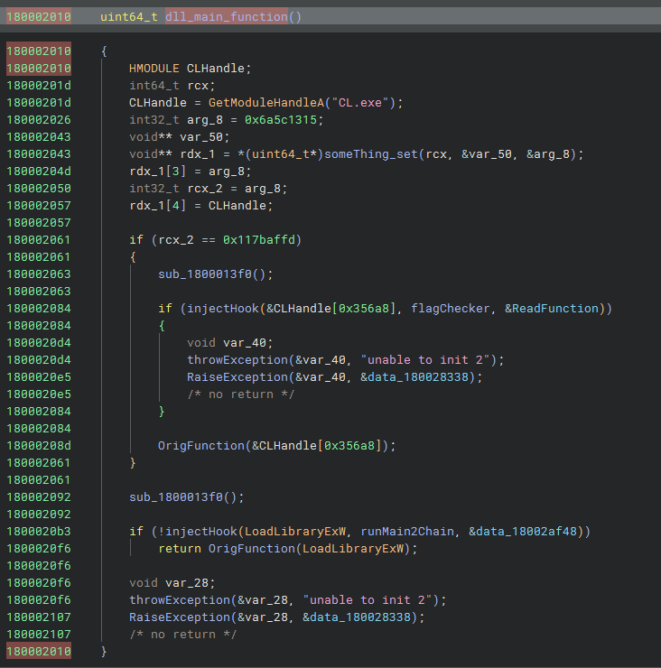
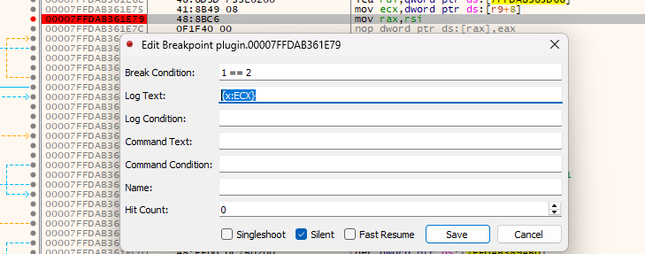

# Alchemy Master

Alchemy Master is a program that injects a custom plugin with hooks into MSVC. A remote is provided that you can give C++ code to compile and if it matches internal constrains you get the flag.

## Solution

The `launch.exe` does exactly what the name suggests and starts the compiler `cl.exe` while injecting the `plugin.dll` into the process.

For debugging purposes breakpoininting after the DLL has been injected but before the DLL entry is executed makes the most sense.
```
14000387d  ff15c5a70100       call    qword [rel CreateRemoteThread]
```

At that point we can attach another debugger to the spawned `cl.exe` process, continue/detach the debugger of `launch.exe` and continue with inspecting the injected DLL.

Within the `plugin.exe` we can follow the initial executed code starting from `1800047ac    uint64_t dllmain_dispatch`.

The relevant main function either directly injects a hook for the flag checker, or hooks LoadLibraryExW to inject the hook when `c2.dll` (The C++ Compiler Backend) has been loaded.



The injected hook intercepts the exported `ReadFunction` function of `c2.dll` which is responsible for compiling C++ functions from MSVC's internal intermedite representation to machine code.
At `180001e00    void flag_checker` the interesting part of the flag checking happens.

- Find the start of the internal IR bytecode (which is a linked list)
- Iterate it and see if it matches any of a set of opcodes
- If the bytecode matches one of the predefined set, decrement and increment values of `180029ab0  uint64_t flagarray[0x7]`
- If all values of `flagarray` match all values of `180025d70  uint64_t comparearray` print the flag

To solve this challenge we need to do the following things:

- Figure out which opcodes are searched for
- Model how the incrementing and decrementing of `flagarray` works for the opcodes
- Given the start values of `flagarray` and the end values of `comparearray`, figure out which opcodes need to appear how often in the program
- Try out / Reverse `c2.dll` to figure out which C++ code generates the right amount of the opcodes we need


The mapping for opcodes to which values are decremented and incremented looks as following:

```
180025d20  struct swcase values[0x9] = 
180025d20  {
180025d20      [0x0] = 
180025d20      {
180025d20          uint32_t opcode_key = 0x91e
180025d24          uint16_t decmask = 0x11
180025d26          uint16_t incmask = 0x40
180025d28      }
180025d28      [0x1] = 
180025d28      {
180025d28          uint32_t opcode_key = 0x852
180025d2c          uint16_t decmask = 0x50
180025d2e          uint16_t incmask = 0x4
180025d30      }
180025d30      [0x2] = 
180025d30      {
180025d30          uint32_t opcode_key = 0x8a2
180025d34          uint16_t decmask = 0x54
180025d36          uint16_t incmask = 0x2
180025d38      }
180025d38      [0x3] = 
180025d38      {
180025d38          uint32_t opcode_key = 0x8a3
180025d3c          uint16_t decmask = 0x9
180025d3e          uint16_t incmask = 0x10
180025d40      }
180025d40      [0x4] = 
180025d40      {
180025d40          uint32_t opcode_key = 0x899
180025d44          uint16_t decmask = 0x41
180025d46          uint16_t incmask = 0x8
180025d48      }
180025d48      [0x5] = 
180025d48      {
180025d48          uint32_t opcode_key = 0x917
180025d4c          uint16_t decmask = 0xc
180025d4e          uint16_t incmask = 0x2
180025d50      }
180025d50      [0x6] = 
180025d50      {
180025d50          uint32_t opcode_key = 0x86c
180025d54          uint16_t decmask = 0x11
180025d56          uint16_t incmask = 0x20
180025d58      }
180025d58      [0x7] = 
180025d58      {
180025d58          uint32_t opcode_key = 0x933
180025d5c          uint16_t decmask = 0x41
180025d5e          uint16_t incmask = 0x20
180025d60      }
180025d60      [0x8] = 
180025d60      {
180025d60          uint32_t opcode_key = 0x93a
180025d64          uint16_t decmask = 0x11
180025d66          uint16_t incmask = 0x20
180025d68      }
180025d68  }
```

For the `decmask` the first 7 bits represent one value in the `flagarray` to decrement when the opcode is found.
Notable here if any of the values that would be decremented is already 0, then we early exit and don't decrement or increment any values.
Similar in the `incmask` each bit represent one value in the `flagarray`, but only one value can be incremented per opcode.
Values can't be incremented beyond 0x4268.

Based on that we get the following code:

```python
def dec(v):
    return v-1
    
def inc(v):
    if v == 0x4268: return v
    return v+1

def k91e(a):
    if(a[0] == 0 or a[4] == 0): return;
    a[0] = dec(a[0]);
    a[4] = dec(a[4]);
    a[6] = inc(a[6]);
    
def k852(a):
    if(a[4] == 0 or a[6] == 0): return;
    a[4] = dec(a[4]);
    a[6] = dec(a[6]);
    a[2] = inc(a[2]);
    
def k8a2(a):
    if(a[2] == 0 or a[4] == 0 or a[6] == 0): return;
    a[2] = dec(a[2]);
    a[4] = dec(a[4]);
    a[6] = dec(a[6]);
    a[1] = inc(a[1]);
    
def k8a3(a):
    if(a[0] == 0 or a[3] == 0): return;
    a[0] = dec(a[0]);
    a[3] = dec(a[3]);
    a[4] = inc(a[4]);
    
def k899(a):
    if(a[0] == 0 or a[6] == 0): return;
    a[0] = dec(a[0]);
    a[6] = dec(a[6]);
    a[3] = inc(a[3]);
    
def k917(a):
    if(a[2] == 0 or a[3] == 0): return;
    a[2] = dec(a[2]);
    a[3] = dec(a[3]);
    a[1] = inc(a[1]); 
    
def k86c(a):
    if(a[0] == 0 or a[4] == 0): return;
    a[0] = dec(a[0]);
    a[4] = dec(a[4]);
    a[5] = inc(a[5]);
    
def k933(a):
    if(a[0] == 0 or a[6] == 0): return;
    a[0] = dec(a[0]);
    a[6] = dec(a[6]);
    a[5] = inc(a[5]);
    
def k93a(a):
    if(a[0] == 0 or a[4] == 0): return;
    a[0] = dec(a[0]);
    a[4] = dec(a[4]);
    a[5] = inc(a[5]);
    
```

And the start and end values look like this:

```python
startArray = [
0x0000000000000734,
0x0000000000000000,
0x0000000000000000,
0x0000000000000000,
0x0000000000000bbc,
0x0000000000000000,
0x0000000000000b63
]

cmpArray = [
0x000000000000014d,
0x00000000000002d7,
0x0000000000000161,
0x00000000000002ea,
0x00000000000001b1,
0x00000000000002fd,
0x0000000000000169
]
```

The next step is figuring out which opcodes to include to get the flag.

I found it helpful to first identify how to generate some of the opcodes as some constructs might generate more than one opcode.

For this I added a breakpoint in x64dbg in the plugin.dll at `plugin.dll:$1E79` which a log text and an impossible break condition to just dump the opcodes in the log.



Doing this I tried multiple input programs and got their respective opcodes.

My limited understanding is that:

- 0x91e -> at every catch handler
- 0x852 -> every write to a variable
- 0x8a2 -> throw stack value
- 0x8a3 -> some kind of branching that happens in try {} catch {} code
- 0x899 -> calling another function
- 0x917 -> throw heap value
- 0x86c -> return stack value
- 0x933 -> start of function
- 0x93a -> end of function

Notably all the exception / throw opcodes generate other used code as well.

As an initial solution (just by going through it by hand) I came up with the following:

```python

a = startArray+[]

k933(a) # start of function

for i in range(746):
    k899(a) # call function
    
for i in range(353):
    k852(a) # store value

for i in range(727):
    k8a2(a) # throw number
    k852(a) # store to compensate

for i in range(763):
    k86c(a) # return values

k93a(a) # end of function

for x in range(len(startArray)):
    print(x, hex(a[x]), "(", hex(startArray[x]), ")", "==", hex(cmpArray[x]), "|" , a[x] == cmpArray[x])
```

Which yields a valid solution, but in reality `throw <number>;` generates other opcodes in the list that interfere with the result.
Specifically a `throw <number>;` first generates a store to a variable, a call, then the actual throwing and an end of function marker.
Compensating the construction for it gives the following solution:

```python
a = startArray+[]

k933(a) # start of function

for i in range(746-727):
    k899(a) # calls
    
for i in range(353):
    k852(a) # stores
    
# these are all generates by "throw <number>;"
for i in range(727):
    k852(a) # store 
    k899(a) # call
    k8a2(a) # throw number
    k93a(a) # end of function
    

for i in range(763-727):
    k86c(a) # return values 

k93a(a) # end of function

for x in range(len(startArray)):
    print(x, hex(a[x]), "(", hex(startArray[x]), ")", "==", hex(cmpArray[x]), "|" , a[x] == cmpArray[x])
```

Which in C++ code looks like 

```python
print("void extr();")
print("int funcT(int v) {")

for i in range(746-727):
    print("extr();") 
    
for i in range(353):
    print("v = 1337;")

for i in range(727):
    print("throw 420;") # this includes the stores, call and end of function

for i in range(763-727):
    print("return 123;")
    
print("}")
```

Generates to

```cpp
void extr();
int funcT(int v) {
extr();
extr();
extr();
extr();
extr();
extr();
extr();
extr();
extr();
extr();
extr();
extr();
extr();
extr();
extr();
extr();
extr();
extr();
extr();
v = 1337;
v = 1337;
v = 1337;
v = 1337;
v = 1337;
v = 1337;
v = 1337;
v = 1337;
v = 1337;
v = 1337;
v = 1337;
v = 1337;
v = 1337;
v = 1337;
v = 1337;
v = 1337;
v = 1337;
v = 1337;
v = 1337;
v = 1337;
v = 1337;
v = 1337;
v = 1337;
v = 1337;
v = 1337;
v = 1337;
v = 1337;
v = 1337;
v = 1337;
v = 1337;
v = 1337;
v = 1337;
v = 1337;
v = 1337;
v = 1337;
v = 1337;
v = 1337;
v = 1337;
v = 1337;
v = 1337;
v = 1337;
v = 1337;
v = 1337;
v = 1337;
v = 1337;
v = 1337;
v = 1337;
v = 1337;
v = 1337;
v = 1337;
v = 1337;
v = 1337;
v = 1337;
v = 1337;
v = 1337;
v = 1337;
v = 1337;
v = 1337;
v = 1337;
v = 1337;
v = 1337;
v = 1337;
v = 1337;
v = 1337;
v = 1337;
v = 1337;
v = 1337;
v = 1337;
v = 1337;
v = 1337;
v = 1337;
v = 1337;
v = 1337;
v = 1337;
v = 1337;
v = 1337;
v = 1337;
v = 1337;
v = 1337;
v = 1337;
v = 1337;
v = 1337;
v = 1337;
v = 1337;
v = 1337;
v = 1337;
v = 1337;
v = 1337;
v = 1337;
v = 1337;
v = 1337;
v = 1337;
v = 1337;
v = 1337;
v = 1337;
v = 1337;
v = 1337;
v = 1337;
v = 1337;
v = 1337;
v = 1337;
v = 1337;
v = 1337;
v = 1337;
v = 1337;
v = 1337;
v = 1337;
v = 1337;
v = 1337;
v = 1337;
v = 1337;
v = 1337;
v = 1337;
v = 1337;
v = 1337;
v = 1337;
v = 1337;
v = 1337;
v = 1337;
v = 1337;
v = 1337;
v = 1337;
v = 1337;
v = 1337;
v = 1337;
v = 1337;
v = 1337;
v = 1337;
v = 1337;
v = 1337;
v = 1337;
v = 1337;
v = 1337;
v = 1337;
v = 1337;
v = 1337;
v = 1337;
v = 1337;
v = 1337;
v = 1337;
v = 1337;
v = 1337;
v = 1337;
v = 1337;
v = 1337;
v = 1337;
v = 1337;
v = 1337;
v = 1337;
v = 1337;
v = 1337;
v = 1337;
v = 1337;
v = 1337;
v = 1337;
v = 1337;
v = 1337;
v = 1337;
v = 1337;
v = 1337;
v = 1337;
v = 1337;
v = 1337;
v = 1337;
v = 1337;
v = 1337;
v = 1337;
v = 1337;
v = 1337;
v = 1337;
v = 1337;
v = 1337;
v = 1337;
v = 1337;
v = 1337;
v = 1337;
v = 1337;
v = 1337;
v = 1337;
v = 1337;
v = 1337;
v = 1337;
v = 1337;
v = 1337;
v = 1337;
v = 1337;
v = 1337;
v = 1337;
v = 1337;
v = 1337;
v = 1337;
v = 1337;
v = 1337;
v = 1337;
v = 1337;
v = 1337;
v = 1337;
v = 1337;
v = 1337;
v = 1337;
v = 1337;
v = 1337;
v = 1337;
v = 1337;
v = 1337;
v = 1337;
v = 1337;
v = 1337;
v = 1337;
v = 1337;
v = 1337;
v = 1337;
v = 1337;
v = 1337;
v = 1337;
v = 1337;
v = 1337;
v = 1337;
v = 1337;
v = 1337;
v = 1337;
v = 1337;
v = 1337;
v = 1337;
v = 1337;
v = 1337;
v = 1337;
v = 1337;
v = 1337;
v = 1337;
v = 1337;
v = 1337;
v = 1337;
v = 1337;
v = 1337;
v = 1337;
v = 1337;
v = 1337;
v = 1337;
v = 1337;
v = 1337;
v = 1337;
v = 1337;
v = 1337;
v = 1337;
v = 1337;
v = 1337;
v = 1337;
v = 1337;
v = 1337;
v = 1337;
v = 1337;
v = 1337;
v = 1337;
v = 1337;
v = 1337;
v = 1337;
v = 1337;
v = 1337;
v = 1337;
v = 1337;
v = 1337;
v = 1337;
v = 1337;
v = 1337;
v = 1337;
v = 1337;
v = 1337;
v = 1337;
v = 1337;
v = 1337;
v = 1337;
v = 1337;
v = 1337;
v = 1337;
v = 1337;
v = 1337;
v = 1337;
v = 1337;
v = 1337;
v = 1337;
v = 1337;
v = 1337;
v = 1337;
v = 1337;
v = 1337;
v = 1337;
v = 1337;
v = 1337;
v = 1337;
v = 1337;
v = 1337;
v = 1337;
v = 1337;
v = 1337;
v = 1337;
v = 1337;
v = 1337;
v = 1337;
v = 1337;
v = 1337;
v = 1337;
v = 1337;
v = 1337;
v = 1337;
v = 1337;
v = 1337;
v = 1337;
v = 1337;
v = 1337;
v = 1337;
v = 1337;
v = 1337;
v = 1337;
v = 1337;
v = 1337;
v = 1337;
v = 1337;
v = 1337;
v = 1337;
v = 1337;
v = 1337;
v = 1337;
v = 1337;
v = 1337;
v = 1337;
v = 1337;
v = 1337;
v = 1337;
v = 1337;
v = 1337;
v = 1337;
v = 1337;
v = 1337;
v = 1337;
v = 1337;
v = 1337;
v = 1337;
v = 1337;
v = 1337;
v = 1337;
v = 1337;
v = 1337;
v = 1337;
v = 1337;
v = 1337;
v = 1337;
v = 1337;
v = 1337;
v = 1337;
v = 1337;
v = 1337;
v = 1337;
throw 420;
throw 420;
throw 420;
throw 420;
throw 420;
throw 420;
throw 420;
throw 420;
throw 420;
throw 420;
throw 420;
throw 420;
throw 420;
throw 420;
throw 420;
throw 420;
throw 420;
throw 420;
throw 420;
throw 420;
throw 420;
throw 420;
throw 420;
throw 420;
throw 420;
throw 420;
throw 420;
throw 420;
throw 420;
throw 420;
throw 420;
throw 420;
throw 420;
throw 420;
throw 420;
throw 420;
throw 420;
throw 420;
throw 420;
throw 420;
throw 420;
throw 420;
throw 420;
throw 420;
throw 420;
throw 420;
throw 420;
throw 420;
throw 420;
throw 420;
throw 420;
throw 420;
throw 420;
throw 420;
throw 420;
throw 420;
throw 420;
throw 420;
throw 420;
throw 420;
throw 420;
throw 420;
throw 420;
throw 420;
throw 420;
throw 420;
throw 420;
throw 420;
throw 420;
throw 420;
throw 420;
throw 420;
throw 420;
throw 420;
throw 420;
throw 420;
throw 420;
throw 420;
throw 420;
throw 420;
throw 420;
throw 420;
throw 420;
throw 420;
throw 420;
throw 420;
throw 420;
throw 420;
throw 420;
throw 420;
throw 420;
throw 420;
throw 420;
throw 420;
throw 420;
throw 420;
throw 420;
throw 420;
throw 420;
throw 420;
throw 420;
throw 420;
throw 420;
throw 420;
throw 420;
throw 420;
throw 420;
throw 420;
throw 420;
throw 420;
throw 420;
throw 420;
throw 420;
throw 420;
throw 420;
throw 420;
throw 420;
throw 420;
throw 420;
throw 420;
throw 420;
throw 420;
throw 420;
throw 420;
throw 420;
throw 420;
throw 420;
throw 420;
throw 420;
throw 420;
throw 420;
throw 420;
throw 420;
throw 420;
throw 420;
throw 420;
throw 420;
throw 420;
throw 420;
throw 420;
throw 420;
throw 420;
throw 420;
throw 420;
throw 420;
throw 420;
throw 420;
throw 420;
throw 420;
throw 420;
throw 420;
throw 420;
throw 420;
throw 420;
throw 420;
throw 420;
throw 420;
throw 420;
throw 420;
throw 420;
throw 420;
throw 420;
throw 420;
throw 420;
throw 420;
throw 420;
throw 420;
throw 420;
throw 420;
throw 420;
throw 420;
throw 420;
throw 420;
throw 420;
throw 420;
throw 420;
throw 420;
throw 420;
throw 420;
throw 420;
throw 420;
throw 420;
throw 420;
throw 420;
throw 420;
throw 420;
throw 420;
throw 420;
throw 420;
throw 420;
throw 420;
throw 420;
throw 420;
throw 420;
throw 420;
throw 420;
throw 420;
throw 420;
throw 420;
throw 420;
throw 420;
throw 420;
throw 420;
throw 420;
throw 420;
throw 420;
throw 420;
throw 420;
throw 420;
throw 420;
throw 420;
throw 420;
throw 420;
throw 420;
throw 420;
throw 420;
throw 420;
throw 420;
throw 420;
throw 420;
throw 420;
throw 420;
throw 420;
throw 420;
throw 420;
throw 420;
throw 420;
throw 420;
throw 420;
throw 420;
throw 420;
throw 420;
throw 420;
throw 420;
throw 420;
throw 420;
throw 420;
throw 420;
throw 420;
throw 420;
throw 420;
throw 420;
throw 420;
throw 420;
throw 420;
throw 420;
throw 420;
throw 420;
throw 420;
throw 420;
throw 420;
throw 420;
throw 420;
throw 420;
throw 420;
throw 420;
throw 420;
throw 420;
throw 420;
throw 420;
throw 420;
throw 420;
throw 420;
throw 420;
throw 420;
throw 420;
throw 420;
throw 420;
throw 420;
throw 420;
throw 420;
throw 420;
throw 420;
throw 420;
throw 420;
throw 420;
throw 420;
throw 420;
throw 420;
throw 420;
throw 420;
throw 420;
throw 420;
throw 420;
throw 420;
throw 420;
throw 420;
throw 420;
throw 420;
throw 420;
throw 420;
throw 420;
throw 420;
throw 420;
throw 420;
throw 420;
throw 420;
throw 420;
throw 420;
throw 420;
throw 420;
throw 420;
throw 420;
throw 420;
throw 420;
throw 420;
throw 420;
throw 420;
throw 420;
throw 420;
throw 420;
throw 420;
throw 420;
throw 420;
throw 420;
throw 420;
throw 420;
throw 420;
throw 420;
throw 420;
throw 420;
throw 420;
throw 420;
throw 420;
throw 420;
throw 420;
throw 420;
throw 420;
throw 420;
throw 420;
throw 420;
throw 420;
throw 420;
throw 420;
throw 420;
throw 420;
throw 420;
throw 420;
throw 420;
throw 420;
throw 420;
throw 420;
throw 420;
throw 420;
throw 420;
throw 420;
throw 420;
throw 420;
throw 420;
throw 420;
throw 420;
throw 420;
throw 420;
throw 420;
throw 420;
throw 420;
throw 420;
throw 420;
throw 420;
throw 420;
throw 420;
throw 420;
throw 420;
throw 420;
throw 420;
throw 420;
throw 420;
throw 420;
throw 420;
throw 420;
throw 420;
throw 420;
throw 420;
throw 420;
throw 420;
throw 420;
throw 420;
throw 420;
throw 420;
throw 420;
throw 420;
throw 420;
throw 420;
throw 420;
throw 420;
throw 420;
throw 420;
throw 420;
throw 420;
throw 420;
throw 420;
throw 420;
throw 420;
throw 420;
throw 420;
throw 420;
throw 420;
throw 420;
throw 420;
throw 420;
throw 420;
throw 420;
throw 420;
throw 420;
throw 420;
throw 420;
throw 420;
throw 420;
throw 420;
throw 420;
throw 420;
throw 420;
throw 420;
throw 420;
throw 420;
throw 420;
throw 420;
throw 420;
throw 420;
throw 420;
throw 420;
throw 420;
throw 420;
throw 420;
throw 420;
throw 420;
throw 420;
throw 420;
throw 420;
throw 420;
throw 420;
throw 420;
throw 420;
throw 420;
throw 420;
throw 420;
throw 420;
throw 420;
throw 420;
throw 420;
throw 420;
throw 420;
throw 420;
throw 420;
throw 420;
throw 420;
throw 420;
throw 420;
throw 420;
throw 420;
throw 420;
throw 420;
throw 420;
throw 420;
throw 420;
throw 420;
throw 420;
throw 420;
throw 420;
throw 420;
throw 420;
throw 420;
throw 420;
throw 420;
throw 420;
throw 420;
throw 420;
throw 420;
throw 420;
throw 420;
throw 420;
throw 420;
throw 420;
throw 420;
throw 420;
throw 420;
throw 420;
throw 420;
throw 420;
throw 420;
throw 420;
throw 420;
throw 420;
throw 420;
throw 420;
throw 420;
throw 420;
throw 420;
throw 420;
throw 420;
throw 420;
throw 420;
throw 420;
throw 420;
throw 420;
throw 420;
throw 420;
throw 420;
throw 420;
throw 420;
throw 420;
throw 420;
throw 420;
throw 420;
throw 420;
throw 420;
throw 420;
throw 420;
throw 420;
throw 420;
throw 420;
throw 420;
throw 420;
throw 420;
throw 420;
throw 420;
throw 420;
throw 420;
throw 420;
throw 420;
throw 420;
throw 420;
throw 420;
throw 420;
throw 420;
throw 420;
throw 420;
throw 420;
throw 420;
throw 420;
throw 420;
throw 420;
throw 420;
throw 420;
throw 420;
throw 420;
throw 420;
throw 420;
throw 420;
throw 420;
throw 420;
throw 420;
throw 420;
throw 420;
throw 420;
throw 420;
throw 420;
throw 420;
throw 420;
throw 420;
throw 420;
throw 420;
throw 420;
throw 420;
throw 420;
throw 420;
throw 420;
throw 420;
throw 420;
throw 420;
throw 420;
throw 420;
throw 420;
throw 420;
throw 420;
throw 420;
throw 420;
throw 420;
throw 420;
throw 420;
throw 420;
throw 420;
throw 420;
throw 420;
throw 420;
throw 420;
throw 420;
throw 420;
throw 420;
throw 420;
throw 420;
throw 420;
throw 420;
throw 420;
throw 420;
throw 420;
throw 420;
throw 420;
throw 420;
throw 420;
throw 420;
throw 420;
throw 420;
throw 420;
throw 420;
throw 420;
throw 420;
throw 420;
throw 420;
throw 420;
throw 420;
throw 420;
throw 420;
throw 420;
throw 420;
throw 420;
throw 420;
throw 420;
throw 420;
throw 420;
throw 420;
throw 420;
throw 420;
throw 420;
throw 420;
throw 420;
throw 420;
throw 420;
throw 420;
throw 420;
throw 420;
throw 420;
throw 420;
throw 420;
throw 420;
throw 420;
throw 420;
throw 420;
throw 420;
throw 420;
throw 420;
throw 420;
throw 420;
throw 420;
throw 420;
throw 420;
throw 420;
throw 420;
throw 420;
throw 420;
throw 420;
throw 420;
throw 420;
throw 420;
throw 420;
throw 420;
throw 420;
throw 420;
throw 420;
throw 420;
throw 420;
throw 420;
throw 420;
throw 420;
throw 420;
throw 420;
throw 420;
throw 420;
throw 420;
throw 420;
throw 420;
throw 420;
throw 420;
throw 420;
throw 420;
throw 420;
throw 420;
throw 420;
throw 420;
throw 420;
throw 420;
throw 420;
throw 420;
throw 420;
throw 420;
throw 420;
throw 420;
throw 420;
throw 420;
throw 420;
throw 420;
throw 420;
throw 420;
throw 420;
throw 420;
throw 420;
throw 420;
throw 420;
throw 420;
throw 420;
throw 420;
throw 420;
throw 420;
throw 420;
throw 420;
throw 420;
throw 420;
throw 420;
throw 420;
throw 420;
throw 420;
throw 420;
throw 420;
throw 420;
throw 420;
throw 420;
throw 420;
throw 420;
throw 420;
throw 420;
throw 420;
throw 420;
throw 420;
throw 420;
throw 420;
throw 420;
throw 420;
throw 420;
throw 420;
throw 420;
throw 420;
throw 420;
throw 420;
throw 420;
throw 420;
throw 420;
throw 420;
return 123;
return 123;
return 123;
return 123;
return 123;
return 123;
return 123;
return 123;
return 123;
return 123;
return 123;
return 123;
return 123;
return 123;
return 123;
return 123;
return 123;
return 123;
return 123;
return 123;
return 123;
return 123;
return 123;
return 123;
return 123;
return 123;
return 123;
return 123;
return 123;
return 123;
return 123;
return 123;
return 123;
return 123;
return 123;
return 123;
}
```

For the remote we need to append `__END__` at the end so the remote knows we are done.

Which gives flag `Good job! Here is your flag: SEKAI{c0ngrats_0n_b3coming_fullm3tal_4lch3m1st_h0p3_y0u_enjoy3d_56f17cf4fa53}`